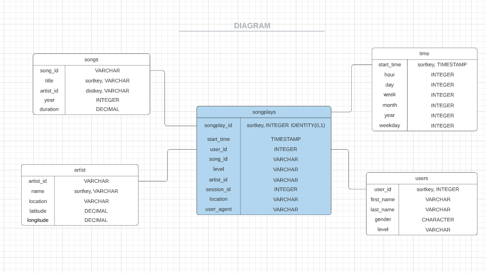

# DATAWAREHOUSE

## Introduction

Due to the dynamic development, the startup called Sparkify collects lots of data. They want to move their processes and data onto the clound which is the most secure, accessible, fast and costeffective way to store and computute the data. 

## Goal of the project
The goal is to built an ETL pipeline that extracts their from S3, stages them in Redshift (data wharehouse with columnar storage), and transforms data into most effective structure - star schema.

## Star schema

## Project structure
- create_table.py  where the fact and dimentional tables in Redshift are created
- etl.py  where data gets loaded from S3 into staging tables on Redshift and processed into the analytics tables 
- sql-queries.py where SQL states are defined
- dwh.cfg where credentials are defined
- README.md current file

## How to run process
1. Create AWS Redshift cluster 

2. You need to fill the information and save it in dwh.cfg file

3. Run '%create_tables.py'

4. Run '%etl.py'

